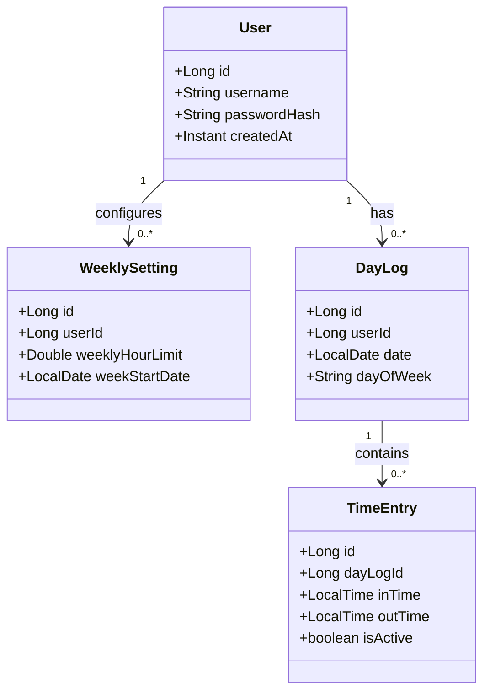

# Domain Model - Work Time Tracker

This document details the core domain entities, relationships, constraints, and business logic calculations for the Work Time Tracker application.

---

## 1. Domain Entities & Fields

### 1.1 User Entity
Represents an authenticated account in the system.
* **Fields:**
  * `id` (Long, Primary Key): Unique identifier.
  * `username` (String, Unique): The user's login identifier.
  * `passwordHash` (String): Securely hashed user password.
  * `createdAt` (Instant): Timestamp of account creation.

### 1.2 WeeklySetting Entity
Configures target guidelines on a per-user, per-week basis.
* **Fields:**
  * `id` (Long, Primary Key): Unique identifier.
  * `userId` (Long, Foreign Key): Reference to the `User`.
  * `weeklyHourLimit` (Double): Target hours to work in a week (default 40.0).
  * `weekStartDate` (LocalDate): The date of the Monday of the trackable week.

### 1.3 DayLog Entity
Groups daily tracking logs for a specific calendar date.
* **Fields:**
  * `id` (Long, Primary Key): Unique identifier.
  * `userId` (Long, Foreign Key): Reference to the `User`.
  * `date` (LocalDate): Calendar date of the log (e.g., `2026-06-24`). Must be a weekday.
  * `dayOfWeek` (Enum): Restrict to weekdays: `MONDAY`, `TUESDAY`, `WEDNESDAY`, `THURSDAY`, `FRIDAY`.

### 1.4 TimeEntry (Clock Session) Entity
Represents an individual clock-in and clock-out event pair.
* **Fields:**
  * `id` (Long, Primary Key): Unique identifier.
  * `dayLogId` (Long, Foreign Key): Reference to the parent `DayLog`.
  * `inTime` (LocalTime): Time the user clocked in (e.g., `09:00:00`).
  * `outTime` (LocalTime, Nullable): Time the user clocked out (e.g., `12:30:00`). Null if the session is currently active.
  * `isActive` (Boolean): Derived flag indicating if `outTime` is null (`true` if user is currently clocked in, `false` otherwise).

---

## 2. Domain Invariants & Business Rules

### 2.1 Time Entry Constraints
1. **Clock-In Restriction:** A `DayLog` can have at most **one** active `TimeEntry` at any time.
   $$\text{ActiveEntriesCount} \le 1$$
   *If an active entry exists, the user must clock out before creating a new `TimeEntry`.*
2. **Chronological Validity:** For any completed `TimeEntry`:
   $$\text{outTime} > \text{inTime}$$
3. **No Overlapping Sessions:** Within a `DayLog`, for any two completed entries $A$ and $B$:
   $$\text{Interval}_A \cap \text{Interval}_B = \emptyset$$
4. **Weekday Restriction:** No `DayLog` or `TimeEntry` may be created or stored for Saturdays or Sundays.

### 2.2 Mathematical Formulas & Calculations

#### A. Daily Duration
For a single completed `TimeEntry` $e$:
$$\text{Duration}(e) = \text{outTime}_e - \text{inTime}_e \quad (\text{expressed in decimal hours})$$

For a `DayLog` $D$:
$$\text{TotalWorkedHours}(D) = \sum_{e \in D.\text{entries}} \text{Duration}(e) \quad \text{where } e.\text{outTime is not null}$$

If a clock-out occurs on the day after clock-in, the entire session duration is calculated and credited to the `DayLog` of the start date (clock-in date).

#### B. Weekly Total
For a week $W$:
$$\text{WeeklyTotalWorked}(W) = \sum_{D \in W} \text{TotalWorkedHours}(D)$$
$$\text{WeeklyRemainingHours}(W) = \max\left(0, \text{WeeklyHourLimit} - \text{WeeklyTotalWorked}(W)\right)$$

#### C. Consistency Target & Status
The weekly target is divided equally across the 5 standard weekdays (Monday to Friday):
$$\text{DailyTarget} = \frac{\text{WeeklyHourLimit}}{5}$$

Let $k$ be the number of weekdays elapsed in the current week (from Monday up to the current day, capped at 5).
$$\text{CumulativeTarget}(k) = k \times \text{DailyTarget}$$
$$\text{CumulativeWorked}(k) = \sum_{i=1}^{k} \text{TotalWorkedHours}(D_i)$$

* **Consistency Check Condition:**
  * **Consistent:** $\text{CumulativeWorked}(k) \ge \text{CumulativeTarget}(k)$
  * **Inconsistent:** $\text{CumulativeWorked}(k) < \text{CumulativeTarget}(k)$

#### D. Recommendation System (Previous Day Loss Recovery)
Let $D_{\text{prev}}$ be the weekday immediately preceding today.
* **If today is Tuesday through Friday:** $D_{\text{prev}}$ is yesterday.
* **If today is Monday:** $D_{\text{prev}}$ is Friday of the previous week.

* **Previous Day Loss ($L$):**
  $$L = \max\left(0, \text{DailyTarget} - \text{TotalWorkedHours}(D_{\text{prev}})\right)$$
  *If $L > 0$, the recommendation system triggers.*

* **Today's Recovery Target ($R$):**
  $$R = \text{DailyTarget} + L$$
  *Recommendation message displays: "You logged a loss of $L$ hours yesterday. You have to spend $R$ hours today to make up for the week."*

