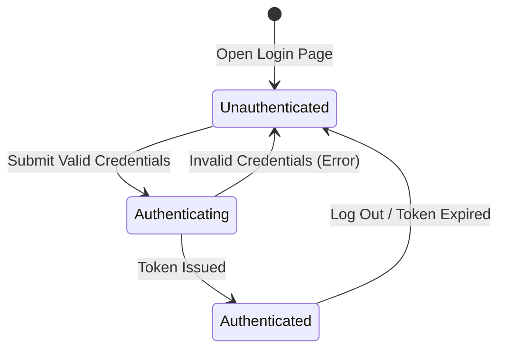

# Data Model: User Login

This document describes the entities and attributes involved in the User Login process.

## 1. User Entity

The user's account details are persisted in the `users.csv` file.

| Field | Type | Description | Constraints |
|---|---|---|---|
| `id` | Long | Auto-incremented unique identifier | Primary Key, Auto-incremented |
| `username` | String | User's unique identification name | Required, Unique, Case-insensitive |
| `passwordHash` | String | BCrypt-hashed password | Required, Valid BCrypt hash format |
| `createdAt` | Timestamp | Timestamp when the user was registered | Required, UTC ISO-8601 string (`YYYY-MM-DDTHH:mm:ssZ`) |

### CSV Serialization Format
The `users.csv` file stores data in the following format:
```csv
id,username,passwordHash,createdAt
1,john_doe,$2a$10$xyz...,2026-06-25T09:47:00Z
```

---

## 2. Session / Auth Token (Ephemeral)

An ephemeral payload returned to the client upon successful authentication, containing the session details.

| Attribute | Type | Description | Format |
|---|---|---|---|
| `token` | String | Cryptographically signed JSON Web Token (JWT) | Base64-encoded signed string |
| `type` | String | Type of authorization mechanism | Constrained to "Bearer" |
| `expiresAt` | Timestamp | Timestamp when the token ceases to be valid | UTC ISO-8601 string |

---

## State Transitions

