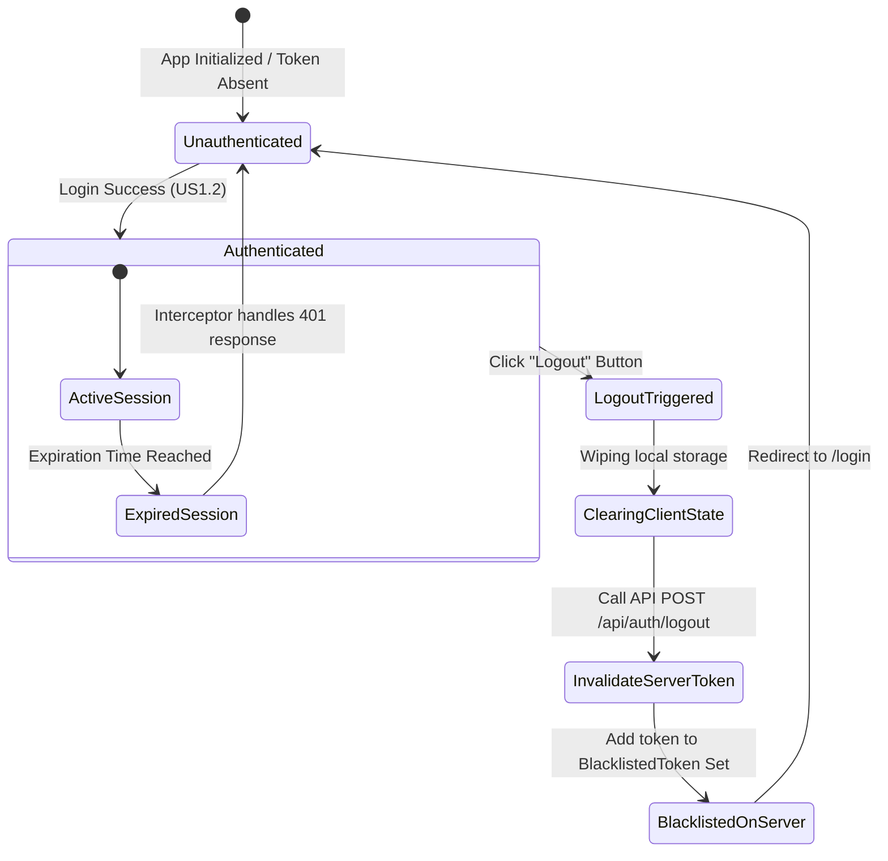

# Data Model & State Design: User Logout

This document details the data structures and state transitions required for the session logout feature.

## 1. Backend In-Memory Data Structure

Since session invalidation uses an in-memory blacklist, the backend stores a collection of revoked tokens.

### Entity: BlacklistedToken

Represents a JWT that has been invalidated before its original expiration time.

| Field | Type | Description | Validation |
|-------|------|-------------|------------|
| `token` | String | The actual signed JWT string. | Must be non-null, non-blank, and have a valid signature. |
| `expiresAt` | Date/Time | The original expiration timestamp from the JWT payload. | Must be a UTC datetime in the future at blacklisting time. |

### Relationships & Storage
- **Storage Type**: Thread-safe in-memory collection (`ConcurrentHashMap` or thread-safe `Set`).
- **Persistence**: Temporary. No CSV representation is needed because once a token reaches its `expiresAt` time, it is naturally invalid and can be discarded.

---

## 2. Frontend Session State

The frontend tracks the active user session status via React state context.

### Structure: AuthState

| Field | Type | Description |
|-------|------|-------------|
| `token` | String \| null | The active JWT token or `null` if unauthenticated. |
| `isAuthenticated` | Boolean | True if a valid session is present. |
| `username` | String \| null | The logged-in user's username or `null` if unauthenticated. |

---

## 3. State Transition Diagram

The lifecycle of a user session and token invalidation behaves as follows:

### Transition Validation Rules
1. **Blacklist Addition**: A token is only added to the `BlacklistedToken` list if the signature is validated successfully and its original expiration timestamp is in the future.
2. **Access Rejection**: Any request containing an authorization token that matches an entry in the `BlacklistedToken` list must be immediately rejected with an HTTP `401 Unauthorized` status.
